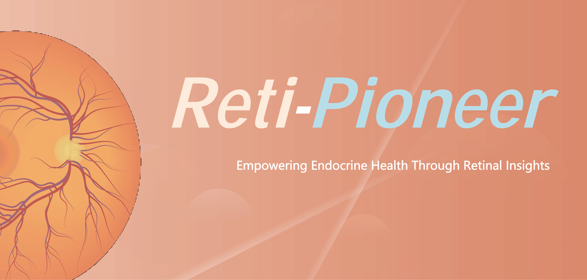

# Reti-Pioneer

From Oculomics to Clinical Practice: A Low-Cost AI Framework for Multimorbidity Detection via Retinal Imaging

For more information, please visit our [website](https://www.retipioneer.cn).

## News

- 2025/07: version 1.0 released

## Hardware requirements

- A consumer-grade GPU (~6GB) is recommended for model training and testing.

## Data

- [UK Biobank](https://www.ukbiobank.ac.uk/) and tertiary hospital centres in China are used for training and fine-tuning in this study.

## Train and test

- Run `python main.py`

## Citation

TBC
